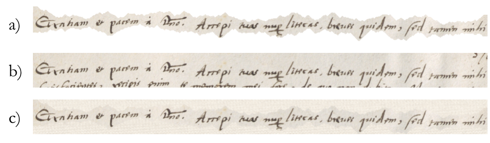

# Bullinger HTR Dataset
A repository containing line images and corresponding text segments for the training of handwritten text recognition models of 15th century correspondence in Latin and Early New High German.


## Description
This dataset contains 165,673 image and corresponding text line files (```.png``` for images and ```.txt``` for the texts) in a **random** 80/10/10 training, validation and test set split. The source is the extensive correspondence of Swiss reformer [Heinrich Bullinger (1504-1575)](https://hls-dhs-dss.ch/de/articles/010443/2011-04-07/) and his over 800 different correspondents. It therefore contains great variety in handwriting styles. Furthermore, it is multilingual since there are Latin and Early New High German (and sometimes mixed) letters. The data is split into Latin and Early New High German (determined with [langid](https://pypi.org/project/langid/)) and put into separate folders (```de``` for Early New High German and ```la``` for Latin).

### Data origins:
- The **images** have been produced from source scanning (after restauration) of the original letters located at the [Zurich States Archive](https://www.zh.ch/de/direktion-der-justiz-und-des-innern/staatsarchiv.html) and [Zurich Central Library](https://www.zb.uzh.ch/de). The letters have been scanned with 300dpi and have been submitted to the Bullinger project team as ```.tif```s.
- The **text** has been taken from the edition[^1] and provisional transcriptions produced for the edition.
- The team at the University of Bern has loaded the images into [Transkribus](https://readcoop.eu/transkribus/?sc=Transkribus) and used the Transkribus-internal Text2Image tool to align the texts to the line images.
- The University of Zurich extraced the available alignments as of **April 1, 2022** and cut the large the TIF files in separate lines according to coordinates identified in the layout recognition step. The ALTO XML contains polygons as can be seen in the image under (a) below. The images were preprocessed as such that the polygon cut-out was pasted on a randomly generated background based on the texture and colours of the cut-out. The ```.png``` files in this repo thus look as under (c) below.

- The data was then randomly split into training (80%), validation and test (each 10%) set. The files on the upper most level of this repo ending in ```.files``` and ```.files.png.txt``` list all the files with relative paths to the respective images and texts.

***IMPORTANT***: Since the alignment between text and image lines was produced in an automated way, it can still contain errors. Also, there could be errors based on the language identification!

### Data organisation
All the data is available in zipped files or split zip files (especially in the train folder, maximum size per file is 2GB). The split zip files in the ```train``` folder can be unified as follows (with the example of the zip file for the files bearing an id from 0 to 2000):

```
zip -F 0-2000-out.zip --out single-0-2000.zip
```

Each file name contains the ID of the letter, the page number of the page from which it was taken, and the region and line number for unique identification. It follows the following pattern:
```[ID]_[page #]_r[region #]l[line #].[png|txt]```
The region and line number are copied from the information from the Transkribus-internal layout recognition tool.

The IDs can be used in the search system (www.bullinger-digital.ch) to search for a letter: ```www.bullinger-digital.ch/letter/[ID]```, e. g., ```www.bullinger-digital.ch/letter/6```.


## Contact
In case of questions please contact
- Prof. Dr. Tobias Hodel, tobias.hodel@unibe.ch
- MA Phillip Ströbel, pstroebel@cl.uzh.ch

We would also like to thank the following collaborators for their support in text-to-image alignment, scan identification and matching:
Anna Janka, Raphael Müller, Peter Rechsteiner, Dr. Patricia Scheurer, David Selim Schoch, Christian Sieber, PD Dr. Raphael Schwitter, Jonas Widmer, Beat Wolf

## Publications
The dataset is described (and used) in more detail in the following publications:
- Tobias Hodel, Phillip Benjamin Ströbel, Andreas Fischer, Anna Scius-Bertrand, Anna Janka, Jonas Widmer, Beat Wolf, Patricia Scheurer, Martin Volk. (in press). Bullingers Briefwechsel zugänglich machen: Stand der Handschriftenerkennung. In *DHd2023: Open Humanities, Open Culture. Konferenzabstracts (tentative title)*, Luxembourg/Trier, Luxembourg/Germany. 9. Jahrestagung des Verbands Digital Humanities im deutschsprachigen Raum e.V. (link follows)
- Phillip Benjamin Ströbel. (in press). *Flexible Techniques for Automatic Text Recognition of Historical Documents*. PhD Thesis, Zürich. (link follows)

[^1]: Heinrich Bullinger Briefwechsel [HBBW], Bd. 1-20, Zürich 1973-2022.
